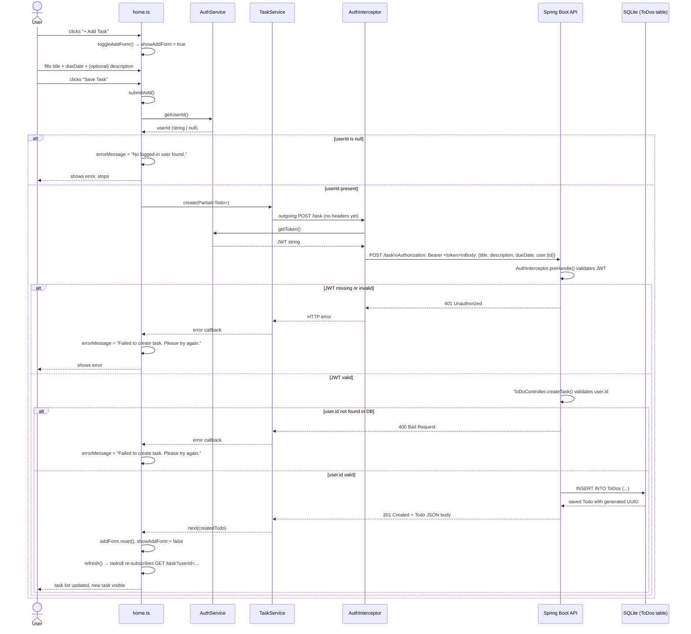

# Design Document — Save Task Persistence

## Overview

This feature wires the existing "Save Task" button on the home page to the existing `POST /task` backend endpoint so that newly entered tasks are persisted in the SQLite database and associated with the logged-in user.

The vast majority of the plumbing already exists:

- `ToDoController.createTask()` accepts a `POST /task` request, validates the user, persists the entity, and returns `201 Created`.
- `home.ts` already has `submitAdd()`, which reads the `userId` from `AuthService`, builds a `Partial<Todo>` payload, and calls `TaskService.create()`.
- `home.html` already renders the reactive form with `Validators.required` on `title` and `dueDate`, shows inline validation errors, and disables the "Save Task" button while the form is invalid.
- `authInterceptor` already attaches `Authorization: Bearer <token>` to every non-public request.
- `TaskService.create()` already issues `POST /task` with the payload.

**The only functional gap** is that after login the `userId` is never extracted from the JWT and written to `localStorage`. The JWT's `subject` claim contains the user's UUID (set by `JwtUtility.generateToken()`), but `login.ts` only stores the raw token string and never calls `authService.setUserId()`. As a result `authService.getUserId()` always returns `null`, `submitAdd()` exits immediately on the guard check, and no HTTP request is ever sent.

The fix is to decode the JWT subject in the `AuthService.login()` observable pipeline (using the existing `JwtUtility` logic—mirrored on the frontend by parsing the base-64 payload) and persist the `userId` alongside the token.

Beyond that root-cause fix, the design addresses several smaller gaps identified during code review:

1. **Backend missing title null-check**: `ToDoController.createTask()` has no explicit guard for a missing `title`. A `null` title will propagate to JPA and throw an unhandled `DataIntegrityViolationException` (500) instead of returning 400.
2. **Login does not return userId**: The login flow does not store `userId` in `localStorage`. `AuthService.login()` must be extended to parse the JWT and call `setUserId()`.
3. **`dueDate` serialization format**: The Angular form collects `dueDate` from a `datetime-local` input as a string like `"2025-06-15T14:30"`. The backend `Todo` entity maps `dueDate` to `LocalDateTime`. Jackson deserializes ISO-8601 strings to `LocalDateTime` by default, but the `datetime-local` format (`yyyy-MM-ddTHH:mm`) omits seconds, which Spring/Jackson accepts. No change is needed here, but the format must be documented.
4. **Error handling for the 401 path**: When `localStorage` contains no JWT, the interceptor passes the request unauthenticated, and the backend returns 401. The existing `error` callback in `submitAdd()` already catches this and displays `"Failed to create task. Please try again."` — sufficient per Requirement 5.

---

## Architecture



---

## Components and Interfaces

### Frontend

#### `AuthService` (modified)

File: `angular/src/app/services/auth-service.ts`

The `login()` method must be extended to parse the JWT subject and store it as `userId` after a successful login response.

The JWT payload is base-64url encoded. The subject UUID lives in the `sub` claim, extractable without a library:

```typescript
private extractUserIdFromToken(token: string): string | null {
  try {
    const payload = JSON.parse(atob(token.split('.')[1]));
    return payload.sub ?? null;
  } catch {
    return null;
  }
}
```

The `login()` pipeline becomes:

```typescript
login(credentials: { email: string; password: string }) {
  return this.http.post(`${this.BASE_URL}/login`, credentials, { responseType: 'text' }).pipe(
    tap((token) => {
      localStorage.setItem(this.TOKEN_KEY, token);
      const userId = this.extractUserIdFromToken(token);
      if (userId) {
        localStorage.setItem(this.USER_ID_KEY, userId);
      }
    })
  );
}
```

No callers of `login()` need to change — the `tap` side effect runs transparently.

#### `home.ts` — `submitAdd()` (no functional changes needed)

The existing `submitAdd()` implementation is correct:

```typescript
submitAdd(): void {
  if (this.addForm.invalid) return;

  const userId = this.authService.getUserId();
  if (!userId) {
    this.errorMessage = 'No logged-in user found.';
    return;
  }

  const { title, description, dueDate } = this.addForm.value;
  const newTask: Partial<Todo> = {
    title: title!,
    description: description ?? '',
    dueDate: dueDate!,
    completed: false,
    user: { id: userId },
  };

  this.tService.create(newTask).subscribe({
    next: () => {
      this.addForm.reset();
      this.showAddForm = false;
      this.refresh();
    },
    error: () => {
      this.errorMessage = 'Failed to create task. Please try again.';
    },
  });
}
```

Once `AuthService.login()` populates `userId` in `localStorage`, this method will function correctly end-to-end without modification.

#### `home.html` (no changes needed)

The template is already complete:
- `[formGroup]="addForm"` binds the reactive form
- `(ngSubmit)="submitAdd()"` triggers submission
- `[disabled]="addForm.invalid"` disables the button when the form is invalid
- Inline `@if` blocks show `"Title is required."` and `"Due date is required."` on touched invalid fields
- `@if (errorMessage)` renders the error banner

#### `TaskService` (no changes needed)

`create(todo: Partial<Todo>)` already posts to `POST /task` and returns `Observable<Todo>`.

#### `authInterceptor` (no changes needed)

Already clones every non-public request and adds `Authorization: Bearer <token>`. Passes requests unauthenticated when no token is present (the backend then returns 401, which the error callback handles).

### Backend

#### `ToDoController` (one change: add title null-check)

File: `spring/todo/src/main/java/teambydefault/todo/controller/ToDoController.java`

The existing `createTask()` method handles `user == null` and `user.id == null`, but not a missing `title`. Add an explicit guard before calling `toDoService.createToDo()`:

```java
@PostMapping
public ResponseEntity<Todo> createTask(@RequestBody Todo toDo) {
    if (toDo.getUser() == null || toDo.getUser().getId() == null) {
        return ResponseEntity.status(HttpStatus.BAD_REQUEST).build();
    }

    // NEW: reject requests with no title
    if (toDo.getTitle() == null || toDo.getTitle().isBlank()) {
        return ResponseEntity.status(HttpStatus.BAD_REQUEST).build();
    }

    User user = userRepo.findById(toDo.getUser().getId()).orElse(null);
    if (user == null) {
        return ResponseEntity.status(HttpStatus.BAD_REQUEST).build();
    }

    toDo.setUser(user);
    Todo created = toDoService.createToDo(toDo);
    return ResponseEntity.status(HttpStatus.CREATED).body(created);
}
```

All other layers (`ToDoService`, `ToDoRepo`, `Todo` entity, `AuthInterceptor` server-side) are already correct and need no changes.

---

## Data Models

### Request body — `POST /task`

The frontend sends a `Partial<Todo>` serialized to JSON. The backend deserializes it directly into the `Todo` entity (no separate DTO currently exists).

```json
{
  "title": "Buy groceries",
  "description": "Milk, eggs, bread",
  "dueDate": "2025-06-20T18:00",
  "completed": false,
  "user": {
    "id": "a1b2c3d4-e5f6-7890-abcd-ef1234567890"
  }
}
```

| Field | Type | Required | Notes |
|---|---|---|---|
| `title` | `string` | Yes | `@Column(nullable=false, unique=true)` |
| `description` | `string` | No | May be empty string |
| `dueDate` | `string` (ISO-8601, no seconds) | Yes per form; nullable in DB | Format: `yyyy-MM-ddTHH:mm` |
| `completed` | `boolean` | No | Defaults to `false` if omitted |
| `user.id` | `string` (UUID) | Yes | Must reference an existing `account` row |

### Response body — `201 Created`

The backend returns the full persisted `Todo` entity serialized to JSON.

```json
{
  "taskId": "f9e8d7c6-b5a4-3210-fedc-ba9876543210",
  "title": "Buy groceries",
  "description": "Milk, eggs, bread",
  "dueDate": "2025-06-20T18:00:00",
  "completed": false,
  "user": {
    "id": "a1b2c3d4-e5f6-7890-abcd-ef1234567890",
    "email": "user@example.com",
    "password": "..."
  }
}
```

> **Note**: The response currently serializes the full `User` object including `email` and `password`. This is a security concern but is out of scope for this feature. A future task should introduce a DTO or `@JsonIgnore` on `password`.

### `Todo` entity (unchanged)

```java
@Entity @Table(name = "ToDos")
public class Todo {
    @Id @GeneratedValue(strategy = GenerationType.UUID)
    @Column(name = "task_id")
    private UUID taskId;

    @ManyToOne @JoinColumn(name = "user", referencedColumnName = "user_id", nullable = false)
    private User user;

    @Column(name = "title", nullable = false, unique = true)
    private String title;

    @Column(name = "description")
    private String description;

    @Column(name = "dueDate")
    private LocalDateTime dueDate;

    @Column(name = "isCompleted")
    private boolean isCompleted;
}
```

### TypeScript `Todo` interface (unchanged)

```typescript
export interface Todo {
  taskId: string;
  title: string;
  description: string;
  dueDate: string;
  completed: boolean;
  user: { id: string };
}
```

---

## Correctness Properties

*A property is a characteristic or behavior that should hold true across all valid executions of a system — essentially, a formal statement about what the system should do. Properties serve as the bridge between human-readable specifications and machine-verifiable correctness guarantees.*

### Property 1: Request body contains all form fields

*For any* valid combination of `title`, `description`, `dueDate`, and `userId`, calling `TaskService.create()` shall emit exactly one POST request to `/task` whose JSON body contains each of those four values in the correct fields (`title`, `description`, `dueDate`, `user.id`).

**Validates: Requirements 1.1, 2.2**

---

### Property 2: Auth interceptor attaches the stored token

*For any* non-empty JWT string stored in `localStorage` under the key `token`, every non-public HTTP request processed by `authInterceptor` shall carry an `Authorization` header whose value is `"Bearer " + token`.

**Validates: Requirements 1.2**

---

### Property 3: Task creation validates user existence and returns 400 for unknown users

*For any* `POST /task` request body, when the `user.id` field is present and non-null but does not correspond to any row in the `account` table, the API shall return `400 Bad Request`. When the `user.id` does correspond to an existing user, the API shall proceed to persist and return `201 Created`.

**Validates: Requirements 1.3, 6.1, 6.2**

---

### Property 4: Task creation is a round-trip — persisted task matches submitted fields

*For any* valid task payload (non-null `title`, optional `description` and `dueDate`, valid `user.id`), submitting `POST /task` shall return `201 Created` with a response body that matches the submitted `title`, `description`, and `dueDate`; and a subsequent `GET /task?userId={userId}` shall return a list containing a task with the same fields.

**Validates: Requirements 1.4, 2.1**

---

### Property 5: User isolation — GET /task returns only the requesting user's tasks

*For any* two distinct users each with at least one task, `GET /task?userId={userA}` shall return only tasks belonging to user A, and `GET /task?userId={userB}` shall return only tasks belonging to user B — no cross-user contamination.

**Validates: Requirements 2.3**

---

### Property 6: Form is invalid whenever title or dueDate is empty

*For any* value of `dueDate` (including valid, empty, and null), the `addForm` reactive form shall be in the `invalid` state when `title` is empty or null. Symmetrically, *for any* value of `title` (including valid), the form shall be in the `invalid` state when `dueDate` is empty or null. The "Save Task" button shall be disabled whenever `addForm.invalid` is true.

**Validates: Requirements 3.1, 3.2**

---

### Property 7: Successful save resets the form and hides it

*For any* valid task submission that results in a `201 Created` response, after the `next` callback completes, `addForm.value` shall have all fields reset to their initial state and `showAddForm` shall be `false`.

**Validates: Requirements 4.1, 4.2**

---

### Property 8: Task list is sorted ascending by due date

*For any* array of `Todo` objects with varying `dueDate` values, the sort applied in `loadTasks()` shall produce an array where `tasks[i].dueDate <= tasks[i+1].dueDate` for all valid `i`.

**Validates: Requirements 4.3**

---

### Property 9: Server-side JWT validation blocks requests without a valid token

*For any* HTTP request to a protected endpoint that carries an absent, malformed, or expired `Authorization` header, the server-side `AuthInterceptor.preHandle()` shall return `false` and set the response status to `401 Unauthorized`.

**Validates: Requirements 6.3**

---

## Error Handling

### Frontend error paths

| Trigger | Handler | User-visible message |
|---|---|---|
| `authService.getUserId()` returns `null` in `submitAdd()` | Early return in `submitAdd()` sets `errorMessage` | `"No logged-in user found."` |
| `TaskService.create()` observable errors (any HTTP error, including 400, 401, 500) | `error` callback in `subscribe()` | `"Failed to create task. Please try again."` |
| `authService.getToken()` returns `null` in interceptor | Interceptor passes request without `Authorization` header; backend returns 401; caught by above error callback | `"Failed to create task. Please try again."` |
| `TaskService.getAllByUser()` errors during task list reload | `catchError` in `loadTasks()` sets `errorMessage` | `"Failed to load tasks. Please try again."` |

The `errorMessage` binding in `home.html` clears on the next successful operation (currently it is never explicitly cleared after a success, but the form hiding effectively removes it from context). A future improvement could clear `errorMessage` at the start of `submitAdd()`.

### Backend error paths

| Trigger | Controller response |
|---|---|
| `user` field is `null` in request body | `400 Bad Request` |
| `user.id` field is `null` in request body | `400 Bad Request` |
| `user.id` does not match any `account` row | `400 Bad Request` |
| `title` is `null` or blank | `400 Bad Request` (after adding the null-check) |
| Missing or invalid `Authorization` header | `401 Unauthorized` (from `AuthInterceptor.preHandle()`) |
| Duplicate `title` (unique constraint violation) | `500 Internal Server Error` — currently unhandled; a `@ExceptionHandler(DataIntegrityViolationException.class)` returning 409 Conflict would improve this, but is out of scope |

---

## Testing Strategy

### Backend (JUnit 5 + H2 + Spring Boot Test)

Use `@SpringBootTest` with H2 replacing SQLite for integration tests, and `@WebMvcTest` with mocked services for controller-layer slice tests.

**Property tests** (use `@RepeatedTest(100)` or a property-based library like [jqwik](https://jqwik.net/) to generate random inputs):

- **Property 3 test**: Generate random UUID values, wire a mock `UserRepo` to recognize a subset, assert 400 for unrecognized and continuation for recognized.
- **Property 4 test**: Generate random `(title, description, dueDate)` tuples with a valid seeded user. POST each, assert 201 and field round-trip. Then GET by userId, assert the task is present.
- **Property 5 test**: Seed two users with random non-overlapping task sets. Assert GET isolation for each.
- **Property 9 test**: Generate random invalid token strings (empty string, truncated JWT, junk text). Assert each returns 401 via MockMvc.

**Example-based tests**:

- POST with `user` absent → 400
- POST with `user.id` absent → 400
- POST with `title` null → 400 (after fix)
- POST with valid body → 201 + correct body
- GET with valid userId → 200 + list
- GET with unknown userId → 400

### Frontend (Jasmine + Angular `TestBed`)

**Property tests** (use [fast-check](https://github.com/dubzzz/fast-check) for input generation, minimum 100 iterations per property):

- **Property 1 test** — `TaskService.create()` body correctness:
  ```
  // Feature: save-task-persistence, Property 1: request body contains all form fields
  fc.assert(fc.property(fc.record({ title: fc.string(), description: fc.string(),
    dueDate: fc.string(), userId: fc.uuidV(4) }), ({ title, description, dueDate, userId }) => {
    // call taskService.create({ title, description, dueDate, user: { id: userId } })
    // capture request via HttpTestingController
    // assert req.request.body matches
  }), { numRuns: 100 });
  ```

- **Property 2 test** — interceptor attaches token:
  ```
  // Feature: save-task-persistence, Property 2: auth interceptor attaches the stored token
  fc.assert(fc.property(fc.string({ minLength: 1 }), (token) => {
    // set localStorage token
    // trigger a request through the interceptor
    // assert Authorization header === `Bearer ${token}`
  }), { numRuns: 100 });
  ```

- **Property 6 test** — form invalid when title or dueDate is empty:
  ```
  // Feature: save-task-persistence, Property 6: form is invalid whenever title or dueDate is empty
  ```

- **Property 7 test** — form resets and hides after success:
  ```
  // Feature: save-task-persistence, Property 7: successful save resets the form and hides it
  ```

- **Property 8 test** — sort order:
  ```
  // Feature: save-task-persistence, Property 8: task list is sorted ascending by due date
  fc.assert(fc.property(fc.array(fc.record({ dueDate: fc.date() })), (todos) => {
    const sorted = [...todos].sort((a, b) => new Date(a.dueDate).getTime() - new Date(b.dueDate).getTime());
    for (let i = 0; i < sorted.length - 1; i++) {
      expect(new Date(sorted[i].dueDate).getTime()).toBeLessThanOrEqual(new Date(sorted[i+1].dueDate).getTime());
    }
  }), { numRuns: 100 });
  ```

**Example-based tests**:

- `login()` stores `userId` in `localStorage` after successful response (tests the AuthService fix)
- Form shows `"Title is required."` after touching title and leaving empty (Requirement 3.3)
- Form shows `"Due date is required."` after touching dueDate and leaving empty (Requirement 3.4)
- API error → `errorMessage` equals `"Failed to create task. Please try again."` (Requirement 5.1)
- No userId in localStorage → `errorMessage` equals `"No logged-in user found."`, no HTTP request made (Requirement 5.2)
