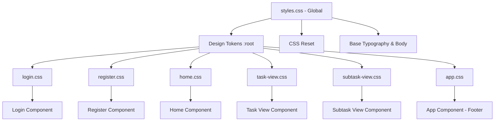

# Design Document: Website Restyling

## Overview

This design defines a complete CSS styling system for the TeamByDefault To-Do application's Angular frontend. The existing HTML templates already use well-structured semantic class names but have zero CSS applied. This design introduces a design-token-based approach using CSS custom properties for consistency, component-scoped stylesheets for encapsulation, and a responsive layout system with a single breakpoint at 768px.

The architecture follows Angular's native component styling model: a single global stylesheet (`styles.css`) provides tokens, resets, and base styles, while each component's scoped CSS file handles component-specific layout and appearance. No external CSS libraries or preprocessors are introduced — the system relies entirely on modern CSS features (custom properties, flexbox, media queries).

### Key Design Decisions

1. **CSS Custom Properties over Sass variables**: Custom properties cascade at runtime, enabling future theming without build-step changes. They are supported in all modern browsers.
2. **Component-scoped CSS via Angular**: Each component's `styleUrl` provides natural encapsulation. Shared patterns (form fields, cards) are achieved through consistent token usage rather than shared CSS classes imported across components.
3. **No CSS framework**: The application is small (6 views). A framework adds weight and learning curve. Hand-written CSS using tokens keeps bundle size minimal and gives full control.
4. **Mobile-first responsive approach**: Base styles target mobile. The `min-width: 768px` media query adds desktop enhancements (max-width constraints, horizontal flex layouts).

## Architecture



### Style Layering

| Layer | File | Responsibility |
|-------|------|---------------|
| 1 - Tokens | `styles.css` `:root` | Color palette, spacing scale, typography, radii, shadows, transitions |
| 2 - Reset | `styles.css` | Box-sizing, margin/padding reset, font inheritance |
| 3 - Base | `styles.css` | Body defaults (font, color, background, smoothing) |
| 4 - Component | `*.css` (scoped) | Layout, card styles, form fields, buttons, states per component |

### Responsive Strategy

- **Breakpoint**: Single breakpoint at `768px`
- **Approach**: Mobile-first — base styles serve narrow viewports; `@media (min-width: 768px)` adds desktop layout
- **Below 768px**: Full-width containers with 16px side padding, stacked layouts, 44px minimum touch targets
- **768px and above**: Containers capped at 600px and centered, horizontal flex rows for headers/items/edit-rows

## Components and Interfaces

### Global Stylesheet (`styles.css`)

**Responsibilities:**
- Define all design tokens as CSS custom properties on `:root`
- Apply universal box-sizing reset
- Set body defaults (font, color, background, smoothing)
- Ensure form elements inherit font

**Token Naming Convention:** `--{category}-{variant}`

| Category | Tokens |
|----------|--------|
| Color | `--color-primary`, `--color-secondary`, `--color-accent`, `--color-bg`, `--color-surface`, `--color-text`, `--color-muted`, `--color-error`, `--color-success`, `--color-border` |
| Spacing | `--spacing-sm`, `--spacing-md`, `--spacing-lg`, `--spacing-xl` |
| Typography | `--font-family`, `--font-size-base`, `--font-size-sm`, `--font-size-lg`, `--font-size-heading`, `--font-weight-normal`, `--font-weight-bold` |
| Radius | `--radius-sm`, `--radius-md`, `--radius-lg` |
| Shadow | `--shadow` |
| Transition | `--transition-duration` |

### Login Component (`login.css`)

**Responsibilities:**
- Vertically and horizontally center `.login-container`
- Card styling (max-width 400px, surface bg, radius, shadow, padding)
- Heading and subtitle typography
- Form field layout with error states
- Full-width submit button with disabled and hover states
- Register link styling

### Register Component (`register.css`)

**Responsibilities:**
- Mirror login container/card layout
- Identical form field and button patterns
- Form-level error message styling
- Login link styling

### Home View (`home.css`)

**Responsibilities:**
- Header flex row (title left, add-btn right)
- Add-form card styling
- Task list (no bullets, gap between items)
- Task item cards with flex row layout
- Completed task decoration (line-through, reduced opacity)
- Delete button styling
- Empty state message
- Hover elevation on task items

### Task View (`task-view.css`)

**Responsibilities:**
- Back button positioning and styling
- Task detail card
- Field label/value pattern
- Edit row flex layout
- Status badge (success/pending variants)
- Subtasks section header
- Subtask item cards (mirrors home task items)
- Add-subtask form card

### Subtask View (`subtask-view.css`)

**Responsibilities:**
- Container card (mirrors task detail card)
- Field label/value pattern (mirrors task view)
- Edit row (mirrors task view)
- Status badge (mirrors task view)
- Back button (mirrors task view)
- Error message styling

### App Component (`app.css`)

**Responsibilities:**
- Fixed footer at viewport bottom
- Surface background with top border
- Centered logout button
- Logout button hover state (fill with error color)
- Body padding-bottom to prevent content occlusion

## Data Models

This feature does not introduce any data models. All work is purely presentational CSS. The existing Angular component models, services, and interfaces remain unchanged.

### Design Token Values

The following concrete values will be used for the design tokens:

```
Colors:
  --color-primary:    #4f46e5  (indigo-600 — primary actions)
  --color-secondary:  #7c3aed  (violet-600 — secondary accent)
  --color-accent:     #06b6d4  (cyan-500 — highlights)
  --color-bg:         #f8fafc  (slate-50 — page background)
  --color-surface:    #ffffff  (white — card backgrounds)
  --color-text:       #1e293b  (slate-800 — body text)
  --color-muted:      #64748b  (slate-500 — secondary text)
  --color-error:      #dc2626  (red-600 — errors/destructive)
  --color-success:    #16a34a  (green-600 — completed states)
  --color-border:     #e2e8f0  (slate-200 — borders)

Spacing:
  --spacing-sm:   0.5rem   (8px)
  --spacing-md:   1rem     (16px)
  --spacing-lg:   1.5rem   (24px)
  --spacing-xl:   2rem     (32px)

Typography:
  --font-family:        'Inter', system-ui, -apple-system, sans-serif
  --font-size-base:     1rem      (16px)
  --font-size-sm:       0.875rem  (14px)
  --font-size-lg:       1.125rem  (18px)
  --font-size-heading:  1.5rem    (24px)
  --font-weight-normal: 400
  --font-weight-bold:   600

Border Radius:
  --radius-sm:  4px
  --radius-md:  8px
  --radius-lg:  12px

Shadow:
  --shadow: 0 1px 3px rgba(0, 0, 0, 0.1), 0 1px 2px rgba(0, 0, 0, 0.06)

Transition:
  --transition-duration: 200ms
```

### Color Contrast Ratios (WCAG 2.1 AA Compliance)

| Pair | Ratio | Passes |
|------|-------|--------|
| `--color-text` (#1e293b) on `--color-surface` (#ffffff) | 12.6:1 | ✓ AA |
| `--color-text` (#1e293b) on `--color-bg` (#f8fafc) | 11.9:1 | ✓ AA |
| `--color-muted` (#64748b) on `--color-surface` (#ffffff) | 5.0:1 | ✓ AA |
| `--color-error` (#dc2626) on `--color-surface` (#ffffff) | 4.6:1 | ✓ AA |
| White (#ffffff) on `--color-primary` (#4f46e5) | 6.3:1 | ✓ AA |
| White (#ffffff) on `--color-success` (#16a34a) | 4.5:1 | ✓ AA (large text / UI) |
| White (#ffffff) on `--color-error` (#dc2626) | 4.6:1 | ✓ AA |

## Error Handling

This feature is purely CSS and does not involve application logic, network requests, or data processing. There are no runtime errors to handle.

**Graceful degradation considerations:**
- If a CSS custom property is unsupported (very old browsers), the `var()` function can accept a fallback value. However, since Angular targets modern browsers, fallbacks are not strictly required.
- If the Inter font fails to load from a CDN, the `system-ui, -apple-system, sans-serif` fallback chain ensures readable text.
- If flexbox is unsupported (pre-2015 browsers), content will stack naturally as block elements — a functional if imperfect layout.


## Correctness Properties

### Property 1: Design Token Completeness

All 26 required CSS custom properties are defined on the `:root` selector in `styles.css`. Specifically: 10 color tokens, 4 spacing tokens, 7 typography tokens, 3 radius tokens, 1 shadow token, and 1 transition token. Removing or renaming any token will break component styles that reference it.

**Validates: Requirements 1.1, 1.2, 1.3, 1.4, 1.5, 1.6**

### Property 2: WCAG Color Contrast Compliance

All text-on-background color pairings used in the application meet WCAG 2.1 AA minimum contrast ratios: 4.5:1 for normal text and 3:1 for large text and UI components. This holds for every combination of foreground token and background token used together.

**Validates: Requirements 10.4**

### Property 3: Responsive Layout Invariant

At any viewport width below 768px, no content container exceeds the viewport width, all interactive elements have a minimum height of 44px, and flex layouts degrade to vertical stacking. At 768px and above, content containers are constrained to a maximum of 600px and centered horizontally.

**Validates: Requirements 9.1, 9.2, 9.3, 9.4**

## Testing Strategy

### Why Property-Based Testing Does Not Apply

This feature is purely visual/CSS with no algorithmic logic, data transformations, or business rules. Property-based testing requires executable functions with defined input/output relationships, which do not exist in this feature.

### Recommended Testing Approaches

**1. Visual Regression Testing (Primary)**
- Use a tool like Percy, Chromatic, or Playwright screenshot comparison to capture baseline screenshots of each view
- Compare against future changes to catch unintended regressions
- Cover: Login, Register, Home (empty + populated), Task View, Subtask View, Footer

**2. Manual Cross-Browser Verification**
- Verify layout in Chrome, Firefox, Safari, and Edge
- Verify responsive behavior at viewport widths of 320px, 768px, and 1200px
- Verify touch target sizes (44px minimum) on mobile viewports

**3. Accessibility Audits**
- Run Lighthouse accessibility audit on each page
- Verify focus indicators are visible on all interactive elements
- Verify color contrast ratios meet WCAG 2.1 AA using browser DevTools or axe

**4. Unit Tests for Token Presence (Optional)**
- A simple test can verify that `styles.css` defines all expected custom properties by parsing the file content
- This guards against accidental token deletion during future refactoring

**5. Component Smoke Tests**
- Verify each component renders without error (existing Angular test infrastructure handles this)
- No new test files are needed for styling alone

### Test Matrix

| View | Desktop (≥768px) | Mobile (<768px) | States |
|------|-------------------|-----------------|--------|
| Login | Centered card | Full-width card | Error, Disabled, Hover |
| Register | Centered card | Full-width card | Error, Disabled, Hover |
| Home | Flex row header, task cards | Stacked layout | Empty, Populated, Completed tasks |
| Task View | Detail card, subtask list | Stacked fields | Edit mode, Status badges |
| Subtask View | Detail card | Stacked fields | Edit mode, Status badges, Error |
| Footer | Fixed bottom, centered btn | Same | Hover state |
